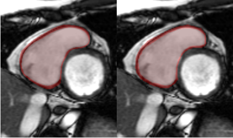
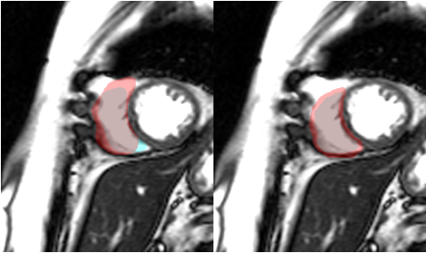

If you are familiar with Chinese, I recommend you to read [中文版README](README_zh.md).

## Preparation

Create a working directory and pull the code.

```
mkdir ws
cd ws
git clone https://github.com/omigeft/RVSC-Medical-Image-Segmentation.git src
```

Tested on Ubuntu 22.04, RTX 4090 * 1, CUDA 12.1, Python=3.10, torch=2.1.2, torchvision=0.16.2. Other similar versions should also work.

To install other required packages, run:

```sh
pip install -r requirements.txt
```

To visualize the training process, you need to register an account on [Weights & Biases](https://wandb.ai/). Then run the following command and follow the instructions to log in.

```sh
wandb login
```

## Data Preprocess

Download the datasets from [https://rvsc.projets.litislab.fr/](https://rvsc.projets.litislab.fr/). Extract them to the `ws` directory and manually organize dataset files into the structure
as follows:

```
/TrainingSet
/TestSet/
  - /Test1Set
  - /Test2Set
  - /Test1SetContours
  - /Test2SetContours
```

Enter the source code directory and run `data_preprocess.py`, automatically processes the RVSC dataset into a trainable format and performs data augmentation. You can specify the times of data augmentation with the `-t` option.

```sh
cd src
python data_preprocess.py -t 4
```

## Training

In the source code directory, run `train.py` to start training.

```sh
python train.py \
--model unet \
--imgs ../train_data_aug/imgs/ \
--masks ../train_data_aug/i-masks/ \
--save ../i-checkpoints/ \
--epochs 50 \
--batch-size 64 \
--scale 0.5 \
-w 1e-4 \
-epc 5 \
-ls dice+ce \
-o adam \
--amp
```

If CUDA runs out of memory, please try reducing the `batch-size` or reducing the image `scale`. On the contrary, if the GPU resources are sufficient and you want to achieve better training results, try increasing `batch-size`, using the original image scale `--scale 1`, or removing the `--amp` option.

## Predicting

```sh
python predict.py \
--pth ../i-checkpoints/unet_checkpoint_epoch50.pth \
--input ../train_data/imgs/P01-0080.png \
--scale 0.5 \
--viz \
--no-save
```

## Evaluating a model on test dataset

```sh
python eval_test.py \
--pth ../i-checkpoints/unet_checkpoint_epoch50.pth \
--input ../test1_data/imgs/ \
--output ../test1_data/i-masks \
--scale 0.5
```

## Segmentation results

After testing, the most effective model is UNet++. The following is a display of some segmentation results. The image on the left is the segmentation result of UNet++, and the image on the right is the real annotated data.





## Acknowledgement

This project refers to the following code:

* [milesial/Pytorch-UNet](https://github.com/milesial/Pytorch-UNet)
* [WZMIAOMIAO/deep-learning-for-image-processing](https://github.com/WZMIAOMIAO/deep-learning-for-image-processing)
* [CSDN blog](https://blog.csdn.net/qq_43205656/article/details/121191937)

I would like to thank the authors for their excellent work.

## License

This project is open source using the [GPL-3.0 licence](LICENSE).
